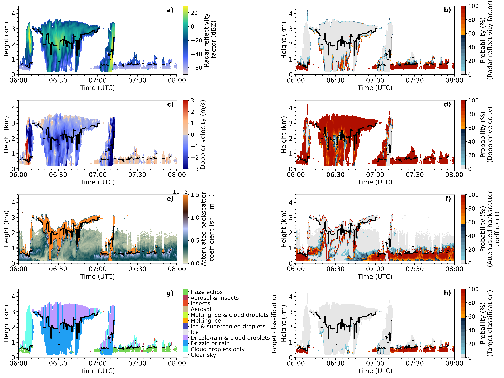
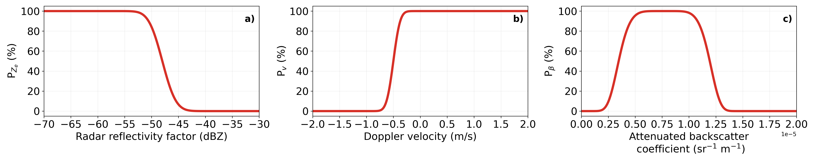

# cloudnet-haze-echoes

Haze echos are classified by the product of heuristic probability functions from individual 
radar and ceilometer observations. The probabilities are estimated similar to
the insect detection method in Cloudnet. 

# Table of Contents
- [Introduction](#introduction)
- [Installation](#installation)
- [Usage](#usage)
- [License](#license)

## Introduction

Haze echos typically show radar relflectivity factors smaller than -50 dBZ and Doppler
velocities close to 0 m/s. Haze echos can also be observed by analyzing the ceilometer
attenuated backscatter coefficient. Appropriate thresholds depend on the 
instrument calibrations.



*02.December 2021 Barbados Cloud Observatory: Observations and corresponding sea salt probabilities for 
the Radar reflectivity factor a)-b), Doppler velocity in c)-d), 
Attenuated backscatter coefficient e)-f) and Cloudnet target classification 
(including the haze echo classification) g)-h). Haze echos are classified when 
the combined probability in h) (combined proabilities of Radar reflectivity factor,
Doppler velocity and Attenuated backscatter coefficient) exceeds 60%. The cloud base height
is marked by the black line.*

## Installation
As input sources the **Cloudnet target classification** and **Cloudnet target categorization** products are mandatory.
1. The package can be installed via pip:
   ```
    python -m pip install git+https://github.com/remsens-lim/cloudnet-haze-echoes
   ```
2. Install the package
   ```sh
    python setup.py install
      ```
<p align="right">(<a href="#top">back to top</a>)</p>

## Usage
To use this project, follow these steps:

1. Import the `CloudProcessor` class from the `main` module.

   ```python
   from haze_echoes.main import ProbabilityCalculator
   ```
2. Define the paths for your input, output, and plot data.
   ```python
   
   path_to_classification_file     =  'CLASSIFICATION PATH'
   path_to_categorization_file     =  'CATEGORIZATION PATH'
   path_to_new_classification_file =  'NEW CLASSIFICATION PATH'
   ```

3. Create an instance of CloudProcessor with the specified file paths.
    ```python
   cloud_processor = ProbabilityCalculator(classification_file = path_to_classification_file , 
                                           categorization_file = path_to_categorization_file ,
                                           path_to_save = path_to_new_classification_file)
                                           

4. Call the create_cloud_dataset method to generate the cloud dataset.
    ```python
   cloud_processor.create_cloud_dataset(dataset_path=output_data, plot=True)
   ```

### Parameters of the probability distributions
The observation parameters are radar reflectivity factor, Doppler velocity and 
attenuated backscatter coefficient. For each observation parameter, a probability 
array is estimated. The distribution features can be selected individually and need
to be adjusted depending on the instrument calibration. 
 


*Probability distributions for radar reflectivity factor P<sub>Ze</sub> in a),
Doppler velocity P<sub>v</sub> in b), and attenuated backscatter 
coefficient P<sub>β</sub> in c).*

### Radar observations
The probability $P(X)$ of a radar observation parameter $X$ at a grid point is given by:

$P(X) = {\frac{1}{2}\left(1 + \text{{erf}}\left(\frac{x - \mu}{\sigma \sqrt{2}}\right)\right)}$

where $\mu$ represents the mean of the distribution and $\sigma$ the standard 
deviation. $\mu$ determines the center of the probability distribution. 
Values smaller than $\mu$ will have small probabilities, while values greater than
$\mu$ will have large probabilities. Additionally, the distribution can be inverted
which is needed for the radar reflectivity factor. $\sigma$ determines the width of the 
probability distribution. A larger value will result in a wider distribution.


1. **`ze_params`** (tuple) - Radar reflectivity threshold parameters
   - **Default Value**: `(-48, 5, True)` (loc, scale, and invert)
   - **Description**: thresholds for the radar reflectivity probability:
     - **loc $\mu$**: the reflectivity at 50% is set to `-48`dBZ as the default
     - **scale $\sigma$**: the default is set to `5`dBZ
     - **invert**: the distribution is inverted and set to `True` as the default
     

2. **`vel_params`** (tuple) - Doppler velocity threshold parameters
   - **Default Value**: `(-1, 0.2, False)` (loc, scale, and invert)
   - **Description**: thresholds for the Doppler velocity probability (downward motion for negative Doppler velocities):
     - **loc $\mu$**: the Doppler velocity at 50% is set to `-1`$m s^{-1}$ as the default to include
     haze echos occurring indowndrafts
     - **scale $\sigma$**: the default is set to `0.2`$m s^{-1}$
     - **invert**: default is `False` as haze echos occur most often in updrafts (positive Doppler velocities)

### Ceilometer observations

For the ceilometer attenuated backscatter coefficient, the probability is estimated using the 
following equation: 

$P(X) = {\frac{\beta}{2\sigma\Gamma\left(\frac{1}{\beta}\right)} \cdot 
\exp\left[-\left(\frac{|x - \mu|}{\sigma}\right)^{\beta} \right]}$

where $\gamma$ represents the gamma distribution and $\mu$ represents 
the center of the distribution at 100\%. The width of the distribution is 
controlled by $\sigma$ and the shape of the distribution is defined by $\beta$.
For example, when $\beta = 1$ the distribution resembles and converges to the Laplace 
distribution. When $\beta=2$ the shape of the distribution becomes the one of a 
normal distribution. When $\beta=\infty$ the shape adapts to a uniform 
distribution. 
1. **`beta_params`** (tuple) - Beta Threshold Parameters
   - **Default Value**: `(6, 0.77e-5, 4.5e-06, False)` (shape, loc, scale, and invert)
   - **Description**: This tuple defines the parameters for beta (attenuation) thresholds. It consists of the following values:
     - **shape $\beta$**:  controls the shape and results in a plateau like shaped distribution for the default `6`
     - **loc $\mu$**: sets the center of the distribution at 100% at the default `0.77e-5` $sr^{-1} m^{-1}$
     - **scale $\sigma$**: determines the width of the distribution with the default set at  `4.5e-06` $sr^{-1} m^{-1}$
     - **invert**: is set to `False` as the default

### Combining probabilities
Probabilities from radar reflectivity factor, Doppler velocity and attenuated backscatter
coefficient are multiplied. For all grid points classified as "Drizzle or rain" the 
Cloudnet target classification is changed to "Haze echos" when the probability exceeds
`0.6` as a default (corresponding to 60%). The threshold for the minimum Haze echo probability can be adjusted. 

## License
Distributed under the GPL-3.0 license. See `LICENSE` for more information.

<p align="right">(<a href="#top">back to top</a>)</p>
